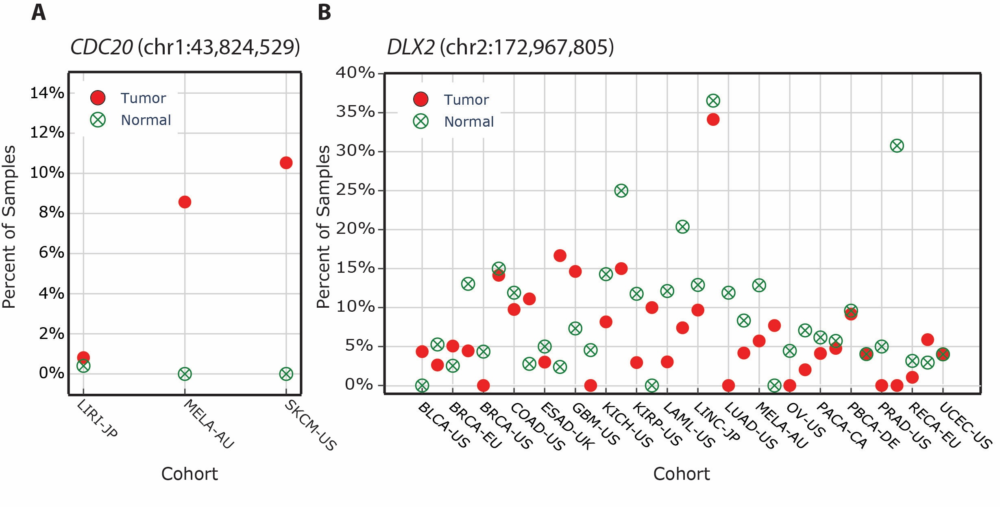

# Deep Pileup

This repository contains a pipeline to perform deep pileup analyses on variant positions across tumor and control BAM files and generate summary statistics and visualizations per gene and genomic position. This helps in identifying problematic positions.

## Overview

The pipeline is designed to work in high-performance computing environments (e.g., DKFZ LSF cluster) and supports automated pileup extraction using `samtools`, downstream aggregation, variant allele frequency (VAF) analysis, and visualization.

## Key Features

- **Automatic pileup calling** using `samtools` on user-provided BAM files.
- **Flexible metadata input** to define control and tumor BAM file paths for each cohort.
- **Custom filtering thresholds**:
  - `minFreq`: minimum frequency to consider a variant (default: 0.9)
  - `minAbs`: absolute read count threshold (default: 2)
  - `minHetSnp`: minimum second allele frequency for heterozygosity (default: 0.25)
- **Visual summaries** including:
  - Allele frequency > 25% across cohorts
  - At least 2 supporting reads per base (A/C/G/T)
- **Support for LSF cluster job submission** via `bsub`
- **Modular structure** for reusability of key components

## Usage

### Step 1: Prepare Input Files

- A metadata CSV file with the following columns:
  - `pid`, `cohort`, `path_to_control_bam`, `path_to_tumor_bam`
- A VCF-like file with columns:
  - `GENE`, `#CHROM`, `POS`

### Step 2: Run the Pipeline

Use `main.py` to iterate through a VCF file and call `deep_pileup_single_position.py` on each site.

```bash
python main.py \
  --path-to-vcf path/to/input.vcf \
  --path-to-metadata path/to/metadata.csv \
  --output-path-to-repository ./deep_pileup_output \
  --path-to-dp-single-position-script ./_deep_pileup_single_position.py \
  --dkfz-cluster True
```

Optional arguments:

- `--starting-index` and `--ending-index`: subset range for variants
- `--dkfz-cluster`: whether to submit jobs via LSF (`True` or `False`)

### Step 3: Output

For each position, the following is generated:

- `pileup_control_<cohort>.txt`, `pileup_tumor_<cohort>.txt`
- `Overview.tsv`: summary statistics for all cohorts
- Visualizations:
  - `af_greater_than_25_only_relevant.png`
  - `af_greater_than_25_all.png`
  - `at_least_two_variant_alleles_only_relevant.png`
  - `at_least_two_variant_alleles_all.png`

## How It Works

For each genomic position provided:

1. The script loads the metadata file and filters out any entries that do not have associated tumor or control BAM files.
2. For each valid cohort:
   - It calls `samtools view` to extract reads from the specified genomic position in each BAM file.
   - The resulting reads are piped into `samtools mpileup` to generate base-level information (pileup).
   - Only the lines corresponding to the target position are retained via `grep`.
3. These pileup outputs are saved into `pileup_control_<cohort>.txt` and `pileup_tumor_<cohort>.txt` files.
4. A summary file (`Overview.tsv`) is generated from all pileup files to report:
   - Total reads and base distribution (A/C/G/T)
   - SNPs with allele frequency > specified thresholds
   - Positions where a base is supported by ≥2 reads
5. Two sets of plots are generated to visualize:
   - Minor allele frequencies greater than 25%
   - Variant bases observed at least twice

## Example

An example of a technically valid genomic position can be seen in (A) whereas a noisy position and potential artifact can seen in (B):


## Dependencies

- Python packages: `pandas`, `numpy`, `plotly`, `tqdm`
- External tools: `samtools` (v1.14 or compatible)

## License

MIT License

## Contact

For questions or support, contact: `nicholas.a.abad@gmail.com`
